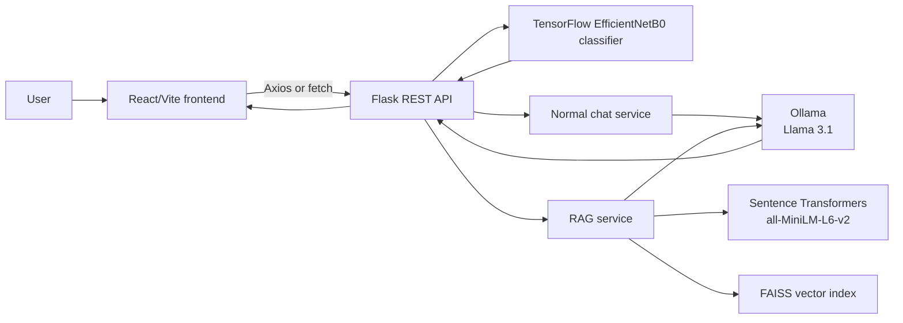

# RoadSense AI Frontend

RoadSense AI is an intelligent road issue detection and RAG AI assistant platform. This repository contains the separated React/Vite frontend for the platform. It provides the browser interface for uploading road images, viewing model predictions, chatting with a local AI assistant, and uploading documents for retrieval-augmented question answering.

The frontend is a portfolio-oriented separation of the frontend component from a COMP258 educational team project originally developed at Centennial College. The original project was developed by a team; this repository does not present that team work as individual work. It is separated here to make the frontend easier to review and maintain.

## Project Overview

RoadSense AI addresses two related road-information workflows:

- Road issue identification: a user uploads an image and the Flask backend uses a trained image-classification model to return a predicted road issue and confidence value.
- Road-information assistance: a user can chat with a local Llama 3.1 service, or upload a PDF, TXT, or DOCX document and ask questions grounded in the uploaded content.

This repository contains the client application only. The Flask API, TensorFlow model, embedding model, FAISS index, and Ollama runtime remain part of the separate backend and ML components.

## Key Features

- React single-page interface built with Vite.
- Navigation between Home, Detect Damage, Prediction Result, and AI Chat views.
- Road image upload through `POST /api/predict`.
- Display of the predicted class, confidence, and backend error responses.
- Local AI chat through `POST /api/chat`.
- Document upload for PDF, TXT, and DOCX files through `POST /api/rag/upload`.
- RAG question answering through `POST /api/rag/ask`.
- Chat mode selection between RAG Knowledge Chat and Normal LLM Chat.
- Enter-key submission for chat messages and in-page conversation history.
- Responsive sidebar navigation that becomes a keyboard-accessible drawer on smaller screens.
- Guided example questions and a bundled original RAG knowledge document for immediate testing.

## How the Platform Works

```text
User
	-> React/Vite frontend
	-> Flask REST API
	-> TensorFlow/EfficientNetB0 model or RAG/Ollama services
	-> JSON API response
	-> React result or chat interface
```

For image analysis, the frontend sends the selected file as multipart form data. The Flask API passes it to the road issue classifier and returns `class_name` and `confidence` values, which the frontend displays on the result view.

For the assistant, normal chat sends a message to the Flask API, which calls the local Ollama service. In RAG mode, the user first uploads a document. The backend extracts and chunks the document, creates Sentence Transformer embeddings, stores them in a FAISS index, retrieves relevant chunks for a question, and asks the local Ollama Llama 3.1 model to answer using that context.

## System Architecture

The technologies below describe the complete RoadSense AI platform. Only the React/Vite, Axios, JavaScript, HTML, and CSS portion is included in this repository.



## Frontend Architecture

The frontend is a small React single-page application. `src/main.jsx` mounts the app and supplies `BrowserRouter`; `src/App.jsx` defines the application routes and renders the navigation component.

```text
RoadSense-AI-Frontend/
├── public/
│   ├── examples/
│   │   ├── rag/
│   │   │   └── roadsense-example-knowledge.txt
│   │   └── road/
│   │       └── README.md
│   └── vite.svg
├── src/
│   ├── assets/
│   │   └── react.svg
│   ├── components/
│   │   ├── ChatbotWidget.jsx
│   │   ├── ImageUploader.jsx
│   │   ├── Navbar.jsx
│   │   └── PredictionResult.jsx
│   ├── pages/
│   │   ├── Chat.jsx
│   │   ├── Detect.jsx
│   │   ├── Home.jsx
│   │   └── PredictResult.jsx
│   ├── services/
│   │   ├── api.js
│   │   ├── chat.js
│   │   ├── chatbot.js
│   │   └── config.js
│   ├── App.css
│   ├── App.jsx
│   ├── index.css
│   └── main.jsx
├── eslint.config.js
├── index.html
├── package-lock.json
├── package.json
└── vite.config.js
```

The page components compose the user views, while the components handle navigation, image selection, prediction display, and chat interactions. State is held locally with React `useState`; prediction data is passed to the result route through React Router location state. The service modules contain the chat and RAG request functions. The current source also includes an Axios instance and older chatbot/config helpers that are not used by the active image and chat flows.

Styling is supplied by `src/App.css`, including the page cards, fixed navigation panel, upload controls, and chat messages. There is no separate frontend state-management library or frontend database.

## Routes

| Frontend route | View | Purpose |
| --- | --- | --- |
| `/` | Home | Introductory road issue detection view |
| `/detect` | Detect | Select an image and submit it for prediction |
| `/result` | PredictionResult | Show the prediction returned by the backend |
| `/chat` | Chat | Use normal chat or RAG document-assisted chat |

## Backend/API Integration

The active frontend calls these Flask API endpoints:

| Method | Endpoint | Frontend use |
| --- | --- | --- |
| `POST` | `/api/predict` | Sends an image in a multipart `image` field and receives prediction data |
| `POST` | `/api/chat` | Sends `{ "message": "..." }` for normal local AI chat |
| `POST` | `/api/rag/upload` | Sends a document in a multipart `file` field for indexing |
| `POST` | `/api/rag/ask` | Sends `{ "question": "..." }` and receives an RAG answer |

The original Flask application also exposes `GET /api/health`, but the active frontend does not call it.

The frontend centralizes its backend base URL in `src/services/config.js`. It defaults to `http://localhost:5000` and can be changed with `VITE_API_BASE_URL`. Copy `.env.example` to `.env` for a local override; Vite exposes only variables prefixed with `VITE_`, and no secrets belong in this file.

Knowledge upload accepts PDF, TXT, DOC, and DOCX files only. Road images belong on the Detect Damage page and are sent to `/api/predict`, not `/api/rag/upload`.

## Feature Guide

### Detect Damage

1. Choose a JPG/JPEG, PNG, or WebP road image, or obtain the documented dataset sample from the source link shown in the uploader.
2. Select **Run detection**. React sends the file in the `image` field to `POST /api/predict`.
3. Flask preprocesses the image and passes it to the trained EfficientNetB0 classifier.
4. Review the predicted category and confidence on the result page.

The sample road image from the original archive is not redistributed because its licensing information is not included. Its exact source path and the public dataset link are documented in `public/examples/road/README.md`.

### Normal LLM Chat

Select **Normal Chat** and choose an example question or write your own:

```text
User question -> Flask -> Ollama / Llama 3.1 -> response
```

No document upload is required. Ollama must be installed, running locally, and have `llama3.1` available.

### RAG Knowledge Chat

Select **RAG Knowledge**, choose **Use example document**, and then click **Upload & index**. The bundled document is original content written for this repository:

```text
public/examples/rag/roadsense-example-knowledge.txt
```

After indexing, click an example question such as:

- What commonly causes potholes?
- Why should damaged road signs be repaired?
- What maintenance actions are described?

The implementation follows:

```text
Document -> extraction -> chunks -> Sentence Transformer embeddings
-> FAISS retrieval -> Ollama / Llama 3.1 -> answer
```

RAG accepts PDF, TXT, DOC, and DOCX only. JPG, JPEG, PNG, and WebP files belong to Detect Damage and are blocked from knowledge upload in the browser and backend.

## Example Files

The original archive was searched recursively before adding examples. It contains the road image dataset and the original project’s RAG upload documents are stored in the separate backend source, not in the downloaded archive. Dataset split CSVs are ML metadata and are not used as RAG examples.

The frontend includes one newly written, copyright-safe TXT knowledge document at `public/examples/rag/roadsense-example-knowledge.txt`. It can be selected without browsing the filesystem and requires an explicit upload action.

The preferred road demonstration is the archive pothole image:

```text
RoadSense-AI-archive/data/Road Issues/Pothole Issues/1_jpg.rf.165df17c20f06ab9f6e719388333fc5c.jpg
```

That file exists in the read-only archive and is part of the dataset identified by the original project as the Kaggle Road Issues Detection Dataset. It was not copied into this repository because the archive does not include clear redistribution licensing information. The Detect Damage page links to the source dataset instead.

## Responsive Design

The interface uses fluid widths, CSS Grid, Flexbox, `clamp()` typography, and responsive breakpoints rather than fixed screen-specific layouts.

- Desktop and laptop: persistent dark sidebar with a wide content canvas.
- Tablet: sidebar becomes an off-canvas navigation drawer with a backdrop and menu button.
- Mobile: single-column feature cards, stacked tool panels, full-width actions, wrapping filenames, and stacked chat composer controls.
- Narrow mobile: reduced page gutters and vertically stacked mode controls to avoid horizontal overflow.

All primary controls use practical tap targets, and navigation includes `aria-expanded`, `aria-controls`, and an accessible close action.

## Technology Stack

### This repository

- React 19
- React DOM
- React Router DOM
- Vite
- Axios
- JavaScript and JSX
- HTML and CSS
- ESLint

### Overall RoadSense AI platform

- Python and Flask for the REST API
- TensorFlow with an EfficientNetB0 image-classification model
- Sentence Transformers using `all-MiniLM-L6-v2` for document embeddings
- FAISS for the in-memory vector index used by the RAG service
- Ollama running the Llama 3.1 local language model

## Getting Started

### Prerequisites

- Node.js and npm compatible with the Vite version in `package.json` (Node.js 18 or newer is a reasonable baseline from the original project documentation).
- A running RoadSense AI Flask backend at the URLs used by the frontend.
- For AI responses, the backend's local Ollama service and the `llama3.1` model must also be available.
- For image predictions and RAG responses, the backend must have its own Python dependencies, trained model, embedding model, and FAISS setup installed.

### Install and run the frontend

```bash
npm install
npm run dev
```

For a local backend override, copy `.env.example` to `.env` before starting Vite:

```bash
cp .env.example .env
```

On Windows PowerShell, use `Copy-Item .env.example .env`. The default is `VITE_API_BASE_URL=http://localhost:5000`.

Vite normally serves the frontend at `http://localhost:5173`. The browser UI can render without the backend, but image detection, normal chat, document upload, and RAG questions require the Flask API to be running on port `5000`.

Useful project commands:

```bash
npm run build   # Create a production build in dist/
npm run lint    # Run ESLint
npm run preview # Preview the production build locally
```

## Manual Test Walkthrough

1. Start the Flask backend and confirm `GET http://localhost:5000/api/health` returns `{"status":"ok"}`.
2. Open `/detect`, choose a permitted road image from the documented source, and run detection. Confirm the result page shows a class and confidence.
3. Open `/chat`, select **Normal Chat**, and use an example question. Confirm Ollama is running if a generated answer is expected.
4. Select **RAG Knowledge**, choose **Use example document**, upload and index it, then ask one of the bundled example questions.
5. Confirm a JPG selected in the RAG picker is not accepted and is never sent to `/api/rag/upload`.
6. Resize the browser through desktop, tablet, and mobile widths. Confirm the drawer navigation, upload controls, cards, filenames, buttons, and chat bubbles remain readable without horizontal scrolling.

## Running the Complete Platform

This repository is frontend-only. Run the separate Flask backend from the original platform with its Python dependencies and make sure its ML and RAG services are available. The original backend documentation describes starting the API with `python app.py`; coordinate the backend working directory and model/runtime setup separately because no backend or ML files are included here.

No maintained backend repository link is recorded in this separated repository. Do not assume that the frontend alone provides prediction or AI services.

## Original Project / Attribution

RoadSense AI is a reorganized portfolio version of the AsphaltAegis COMP258 educational team project developed at Centennial College. The original project documentation credits the team members Numaan Baig, Anmol, Raj Patel, Juan, Jaturaput, Daniela, and Abdallah. This repository separates the React frontend for portfolio presentation and maintainability while preserving the distinction between team-developed source work and individual contributions.

The original project was documented for educational use and was not presented as verified production software. That limitation applies to the platform context described here.

## Additional Documentation

The source project contains broader backend, ML, model-card, and architecture documentation. Those materials are intentionally not copied into this frontend repository because they describe components that remain outside this codebase. The API contract summarized above is derived from the active frontend request code and the original Flask routes.
